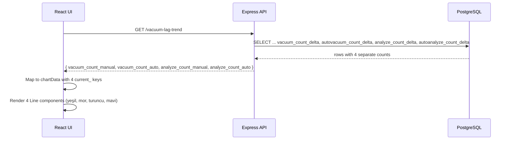

# Design Document: Vacuum Lag Split Activity

## Overview

Bu degisiklik, Vacuum Lag sekmesindeki tek "vacuum_count" alanini 4 ayri alana (manual vacuum, autovacuum, manual analyze, auto analyze) bolmektedir. Backend'de SQL sorgulari guncellenir, frontend'te Bar grafik yerine 4 renkli Line grafik kullanilir.

Degisiklik sinirlari:
- Sadece 2 dosya etkilenir: `api/src/routes/insights.ts` ve `ui/src/pages/Insights.tsx`
- DB sema degisikligi yok (mevcut kolonlar zaten mevcut)
- Yeni paket eklenmez
- Diger sekmeler etkilenmez

## Architecture

Mevcut mimari korunur. Tek degisiklik veri seklindedir:

```
[PostgreSQL fact/agg tablolari]
    |
    v (4 ayri SUM yerine 1 combined SUM)
[Express API Endpoint]
    |
    v (JSON response: 4 alan)
[React Frontend - Recharts]
    |
    v (4 Line component)
[Kullanici Ekrani]
```

### Veri Akisi



## Components and Interfaces

### Backend (api/src/routes/insights.ts)

#### fetchVacuumLagTrendData

Mevcut: Tek `vacuum_count` alani donuyor (manual + auto birlesik).

Yeni: 4 ayri alan donecek:
- fact branch: `sum(coalesce(vacuum_count_delta, 0))::bigint as vacuum_count_manual`
- fact branch: `sum(coalesce(autovacuum_count_delta, 0))::bigint as vacuum_count_auto`
- fact branch: `sum(coalesce(analyze_count_delta, 0))::bigint as analyze_count_manual`
- fact branch: `sum(coalesce(autoanalyze_count_delta, 0))::bigint as analyze_count_auto`
- agg branch: `sum(coalesce(vacuum_count_sum, 0))::bigint as vacuum_count_manual`
- agg branch: `sum(coalesce(autovacuum_count_sum, 0))::bigint as vacuum_count_auto`
- agg branch: `sum(coalesce(analyze_count_sum, 0))::bigint as analyze_count_manual`
- agg branch: `sum(coalesce(autoanalyze_count_sum, 0))::bigint as analyze_count_auto`

#### fetchTableVacuumTrend

Mevcut: Birlesik `vacuum_count` (manual + auto) ve ayri `analyze_count` (manual + auto) donuyor.

Yeni: 4 ayri alan donecek, ayni pattern. `vacuum_count` ve `analyze_count` kalkacak.

### Frontend (ui/src/pages/Insights.tsx)

#### VacuumLagTrendPoint Interface

```typescript
interface VacuumLagTrendPoint {
    bucket_start: string;
    bucket_aligned?: string;
    total_dead_tup: string | number;
    vacuum_count_manual: string | number;
    vacuum_count_auto: string | number;
    analyze_count_manual: string | number;
    analyze_count_auto: string | number;
}
```

#### TableVacuumTrendPoint Interface

```typescript
interface TableVacuumTrendPoint {
    bucket_start: string;
    bucket_aligned?: string;
    dead_tup: string | number;
    live_tup: string | number;
    n_tup_upd: string | number;
    n_tup_del: string | number;
    n_tup_ins: string | number;
    vacuum_count_manual: string | number;
    vacuum_count_auto: string | number;
    analyze_count_manual: string | number;
    analyze_count_auto: string | number;
}
```

#### ChartData Mapping (VacuumLagCardInner)

```typescript
{
    label: formatBucket(...),
    bucket_iso: ...,
    bucket_key: key,
    current_dead_tup: toNum(p.total_dead_tup),
    previous_dead_tup: previous ? toNum(previous.total_dead_tup) : null,
    current_vacuum_manual: toNum(p.vacuum_count_manual),
    current_vacuum_auto: toNum(p.vacuum_count_auto),
    current_analyze_manual: toNum(p.analyze_count_manual),
    current_analyze_auto: toNum(p.analyze_count_auto),
    previous_vacuum_total: previous
        ? toNum(previous.vacuum_count_manual) + toNum(previous.vacuum_count_auto)
          + toNum(previous.analyze_count_manual) + toNum(previous.analyze_count_auto)
        : null,
}
```

#### ChartData Mapping (TableVacuumTrendPanel)

```typescript
{
    // ... mevcut dead_tup, upd_del alanlari korunur
    current_vacuum_manual: toNum(p.vacuum_count_manual),
    current_vacuum_auto: toNum(p.vacuum_count_auto),
    current_analyze_manual: toNum(p.analyze_count_manual),
    current_analyze_auto: toNum(p.analyze_count_auto),
    previous_vacuum_total: previous
        ? toNum(previous.vacuum_count_manual) + toNum(previous.vacuum_count_auto)
          + toNum(previous.analyze_count_manual) + toNum(previous.analyze_count_auto)
        : null,
}
```

#### Renk Skalasi

| Line | Renk | Hex |
|------|------|-----|
| Manuel Vacuum | Yesil | #059669 |
| Autovacuum | Mor | #7C3AED |
| Manuel Analyze | Turuncu | #D97706 |
| Auto Analyze | Mavi | #2563EB |

## Data Models

Degisiklik yok. Mevcut tablo kolonlari kullanilir:

**fact.pg_table_stat_delta**: `vacuum_count_delta`, `autovacuum_count_delta`, `analyze_count_delta`, `autoanalyze_count_delta`

**agg.pg_table_stat_hourly**: `vacuum_count_sum`, `autovacuum_count_sum`, `analyze_count_sum`, `autoanalyze_count_sum`


## Correctness Properties

*A property is a characteristic or behavior that should hold true across all valid executions of a system — essentially, a formal statement about what the system should do. Properties serve as the bridge between human-readable specifications and machine-verifiable correctness guarantees.*

### Property 1: Vacuum-lag-trend response shape

*For any* valid response from the vacuum-lag-trend endpoint, each row SHALL contain `vacuum_count_manual`, `vacuum_count_auto`, `analyze_count_manual`, and `analyze_count_auto` fields with numeric values, and SHALL NOT contain a `vacuum_count` field.

**Validates: Requirements 1.1, 1.2**

### Property 2: Table-vacuum-trend response shape

*For any* valid response from the table-vacuum-trend endpoint, each row SHALL contain `vacuum_count_manual`, `vacuum_count_auto`, `analyze_count_manual`, and `analyze_count_auto` fields with numeric values, and SHALL NOT contain a combined `vacuum_count` field.

**Validates: Requirements 2.1, 2.2**

### Property 3: Compare total is sum of parts

*For any* set of previous period values (vacuum_count_manual, vacuum_count_auto, analyze_count_manual, analyze_count_auto), the computed `previous_vacuum_total` SHALL equal the arithmetic sum of all 4 individual values.

**Validates: Requirements 3.4, 4.4**

### Property 4: ChartData mapping correctness

*For any* valid API response data (array of VacuumLagTrendPoint or TableVacuumTrendPoint), the resulting chartData array SHALL contain `current_vacuum_manual`, `current_vacuum_auto`, `current_analyze_manual`, and `current_analyze_auto` keys derived from the corresponding response fields via numeric conversion.

**Validates: Requirements 5.5, 5.6**

## Error Handling

- Mevcut null-safe coalesce pattern korunur — tum yeni SQL ifadeleri `coalesce(..., 0)` kullanir
- Frontend'te `toNum()` helper mevcut null/undefined/NaN durumlarini 0'a cevirir
- Compare modu kapali iken previous_vacuum_total hesaplanmaz (null kalir)
- TypeScript derleyici hatalari `npx tsc --noEmit` ile dogrulanir

## Testing Strategy

### Build/Compile Verification

- `api`: `npx tsc --noEmit` — tip uyumlulugu
- `ui`: `npx tsc --noEmit` ve `npm run build` — tip uyumlulugu + bundle uretimi

### Unit Tests

Unit testler yazilmayacak cunku:
1. Degisiklik saf SQL kolon yeniden adlandirma + frontend mapping degisikligi
2. Mevcut endpoint handler yapisi korunuyor (sadece SELECT ifadesi degisiyor)
3. tsc --noEmit tip guvenligini sagliyor

### Property-Based Testing

Bu degisiklik icin property-based test uygun degil cunku:
- Backend degisikligi saf SQL kolon aliasing (coalesce wrapping ile)
- Frontend degisikligi statik mapping ve sabit renk/config atama
- Randomize edilecek logic yok — transformation deterministik ve trivial
- tsc --noEmit + npm run build yeterli dogrulama saglar

### Manual Verification Checklist

1. Vacuum Lag sekmesi → ana grafikte 4 renkli line, bar yok
2. Per-table expand panel → 3. grafik artik LineChart, 4 line
3. Legend'da 4 isim: Manuel Vacuum, Autovacuum, Manuel Analyze, Auto Analyze
4. Compare overlay acikken sadece TEK dashed gri line (toplam)
5. Network'te response'ta 4 yeni alan var, eski vacuum_count yok
